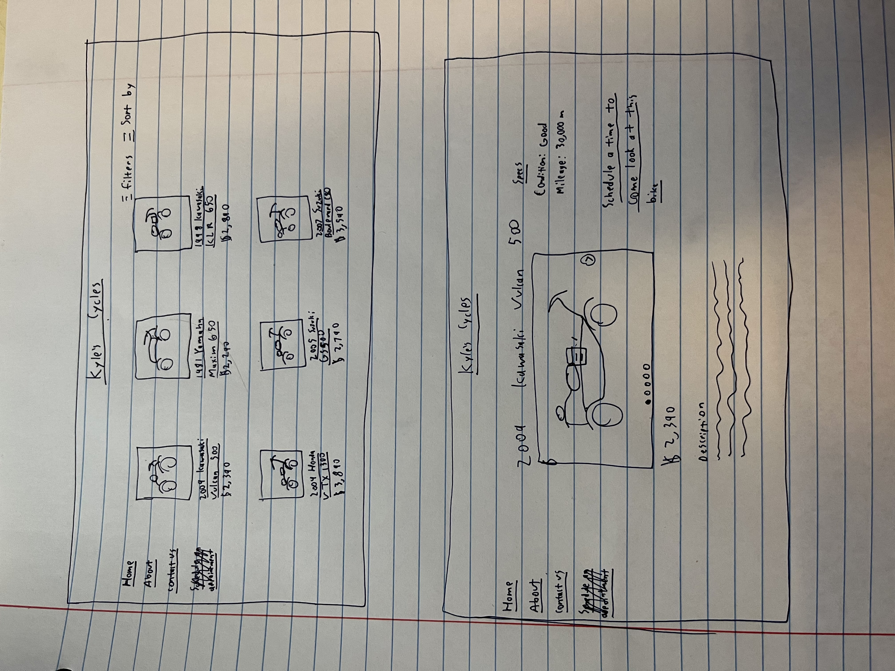

# kyles-cycles
**The amazing website for all of Kyle's cycles**

## Description Deliverable:

### Elevator Pitch:

Have you ever wanted to start a company where you fix and sell motorcycles but you're held back because you don't have a website to post all of the motorcycles you're selling. Kyle's Cycles (or different website if your name happens to not be Kyle) is a phenomenal website where potential buyers can quickly see all motorcycles currently for sale at a glance and schedule appointments to come and check out and buy the motorcycle of their dreams. You'll never have to worry about posting to KSL again!

### Design:

The first sample screens shows what the landing screen for the website will look like and the second shows the screen that will appear when a user selects a specific motorcyle to look at to see more details.

### Key Features:

 - Display of all motorcycles available for sale on one screen in addition to individual splash screens for each bike
 - Ability to sort motorcycles by price/year
 - Admin can upload motorcycles/mark them as sold as needed
 - Appointment scheduler where buyers can see all available times to come look at bikes
 - Ability to have secure login
 - Ability to save motorcycles to look at later

### Technologies:

I am going to use the required technologies in the following ways.

- **HTML** - I will use HTML to design the basic structure of the different pages. Home, contact, and about pages, in addition to individual pages for each motorcycle. Links between each page to the main pages.
- **CSS** - I will use CSS to add styling to the webpages. Consistency across different pages in heading and colors. Good principles of design choice and design elements will be implemented.
- **JavaScript** - I will use JS to provide login, mark a motorcycle as 'favorite' and save it for later, schedule appointments.
- **Service** - Backend service with endpoints for:
  - login
  - scheduling appointments
  - canceling appointments
  - marking favorite bikes
- **DB** - Store users credentials, bikes they've chosen to save, choices, and votes in database.
- **Login** - Users will be able to login in order to favorite bikes they like and schedule appointments.
- **WebSocket** - The number of views each bike receives will be recorded and reported as a way to show 'popular' motorcycles.
- **React** - Application ported to use the React web framework.

## HTML Deliverable:

For this deliverable I built out the structure of my application using HTML.

**HTML pages** - Built 6 HTML pages for the following tasks:
 - Main page that displays motorcycles for sale
 - About page that shows info for the company
 - Contact info page
 - Motorcycle page that shows more detailed info for a motorcycle
 - Appointment scheduler page where people can fill out a form to schedule a time to check out a motorcycle
 - Appointment schedule success page that pops up when the form has been successfully completed

**Links** - Most of the pages have a menu at the top to connect to the main, about, and contact pages. The main page has motorcycle pics/names that link to the motorcycle page. The motorcycle page has a link to fill out an appoint.

**Text** - There is a sample text description for motorcycle details as well as text on the about page that describes the business

**Placeholder for 3rd Party Service Calls** - The info on the forms will eventually sync up with google calendar and automatically put appointments in and update which times are free

**Images** - Included placeholder images on the main, about, and motorcycle pages. These images show which motorcycles are for sale

**Login** - Input box for username and password for the admin to log in and gain admin priveleges

**Database** - The different motorcycles for sale will be pulled from a database

**WebSocket** - The views section shows where the views of the motorcycle will be displayed

## CSS Deliverable:

For this deliverable I properly styled the webpage into its final appearance.

**Header, footer, and main content body** - Added proper color and spacing

**Navigation elements** - I formatted the navigation menu into a menu at the top

**Responsive to window resizing** - The webpage properly adjusts to display well on phones or small browsers. Main changes being the shifting of table elements to be in one portrait-style table as the browser shifts sizes.

**Application elements** - Used good contrast and whitespace

**Application text content** - Consistent fonts and styling

**Application images** - Adjusted the styling of the images and their place on the page
